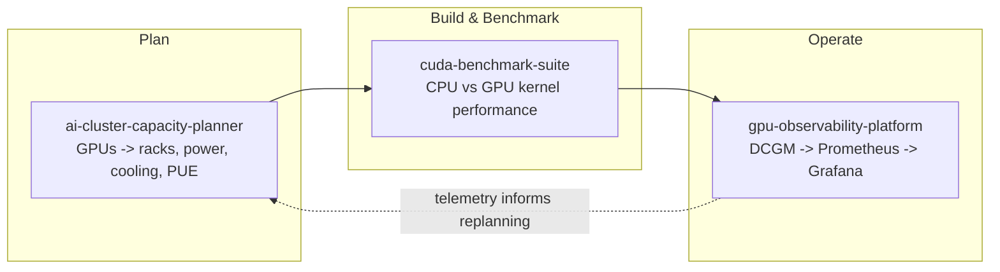

# NVIDIA AI & HPC Portfolio

[](https://github.com/m-aboud/nvidia-ai-hpc-portfolio/actions/workflows/python-check.yml)
[](LICENSE)


A hands-on portfolio for **AI Infrastructure, GPU Computing, HPC, Data Center
Engineering, and NVIDIA-ecosystem roles**. It connects software-level GPU
awareness to the real production concerns of an AI factory: performance,
capacity, power, cooling, and observability.

## Projects

| Project | Purpose | Skills Demonstrated |
|---|---|---|
| [[`cuda-benchmark-suite`](https://github.com/m-aboud/cuda-benchmark-suite)] | CUDA CPU vs GPU benchmarking | CUDA C++, kernel timing, Linux build, Docker |
| [[`ai-cluster-capacity-planner`](ai-cluster-capacity-planner)](https://github.com/m-aboud/ai-cluster-capacity-planner) | AI/HPC GPU cluster sizing tool | Python, power/cooling/PUE modeling, tested CLI |
| [[`gpu-observability-platform`](gpu-observability-platform)](https://github.com/m-aboud/gpu-observability-platform) | NVIDIA GPU monitoring stack | DCGM Exporter, Prometheus, Grafana, Docker, observability |

## How the Pieces Fit Together



The three projects mirror the lifecycle of a GPU platform: **plan** the
facility, **build and benchmark** the GPU workloads, then **operate and
observe** the fleet in production.

## Repository Layout

```text
nvidia-ai-hpc-portfolio/
├── projects/
│   ├── cuda-benchmark-suite/        # CUDA C++ benchmarks + Docker + Makefile
│   ├── ai-cluster-capacity-planner/ # Python CLI + unit tests + examples
│   └── gpu-observability-platform/  # DCGM + Prometheus + Grafana stack
├── docs/                            # Upload steps + recruiter pitch
├── .github/workflows/               # CI: ruff lint + unit tests
├── LICENSE
└── PROJECT_SUMMARY.md
```

## Quick Start

```bash
git clone https://github.com/m-aboud/nvidia-ai-hpc-portfolio.git
cd nvidia-ai-hpc-portfolio
```

**Capacity planner** (pure Python, no dependencies):

```bash
cd projects/ai-cluster-capacity-planner
python3 src/planner.py --gpus 4096 --gpu-type H100-SXM --rack-kw 80 --pue 1.35
python3 -m unittest discover -s tests        # run the test suite
```

**GPU observability stack** (needs Docker + NVIDIA Container Toolkit):

```bash
cd projects/gpu-observability-platform
docker compose up -d
```

**CUDA benchmark suite** (needs a CUDA-enabled Linux machine + `nvcc`):

```bash
cd projects/cuda-benchmark-suite
make
make run
```

## Why This Portfolio Exists

Modern AI and HPC platforms are not only about GPUs. They require high-density
power and cooling design, Linux and containerized infrastructure, GPU telemetry
and health monitoring, capacity planning for large clusters, performance
benchmarking, and clear technical communication. This repo demonstrates those
capabilities in a practical, reviewable format.

## Roles This Supports

AI Infrastructure Architect · HPC Infrastructure Engineer · NVIDIA Solutions
Architect · GPU Platform Engineer · Data Center AI Factory Architect · Cloud /
Infrastructure Architect · Technical Program Manager (AI Infrastructure).

## Suggested Resume Bullet

> Built a GitHub portfolio demonstrating CUDA benchmarking, AI/HPC cluster
> capacity planning, and NVIDIA GPU observability using CUDA C++, Python, Docker,
> Prometheus, Grafana, and NVIDIA DCGM Exporter.

## Notes

Benchmark values under `results/` and the GPU power figures in the capacity
planner are documented **planning assumptions / sample outputs**. Real results
vary by GPU model, CUDA version, CPU, memory, driver, and system configuration,
and power assumptions should be validated against vendor design guides before
production use.

## License

Released under the [MIT License](LICENSE).

---

Maintained by [**Mohammed Aboud**](https://github.com/m-aboud).
